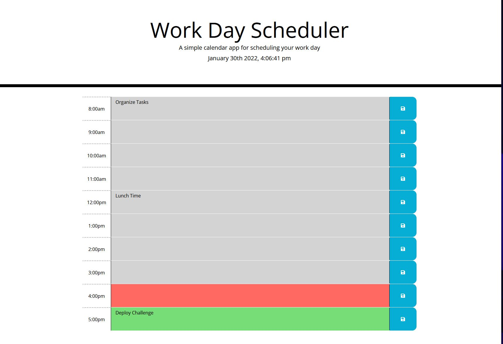

# Work-Day-Scheduler

  ## Table of Content
  * [Description](#description)
  * [App Overview](#app-overview)
  * [Deployed App](#deployed-app)
  * [Contributions](#contributions)

## Description
Simple calendar application allowing user to save a task for each hour from 8am to 5pm.

## App Overview

## Deployed App
[Deployed App](https://juliorios15.github.io/Work-Day-Scheduler/)

## Contributions
contributions are always welcome!